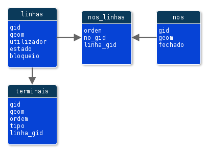

# Projeto GeoRede5

Tentativa de desenvolvimento de um modelo genérico de dados, em português para **serviços de utilidade pública** (*utilities*)

# inicio_pg

Repositório inicial para as primeiras explorações.

Criado em Jan 2021

